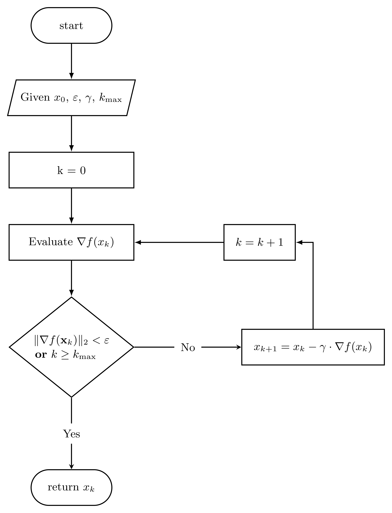

Gradient descent with constant step
====================================

:math:`\rule{125mm}{0.7pt}`

.. rubric::  Algorithm Flowchart

:math:`\rule{125mm}{0.7pt}`

:math:`\rule{125mm}{0.7pt}`

.. autofunction:: nueramic_mathml.multi_optimize.gd_constant