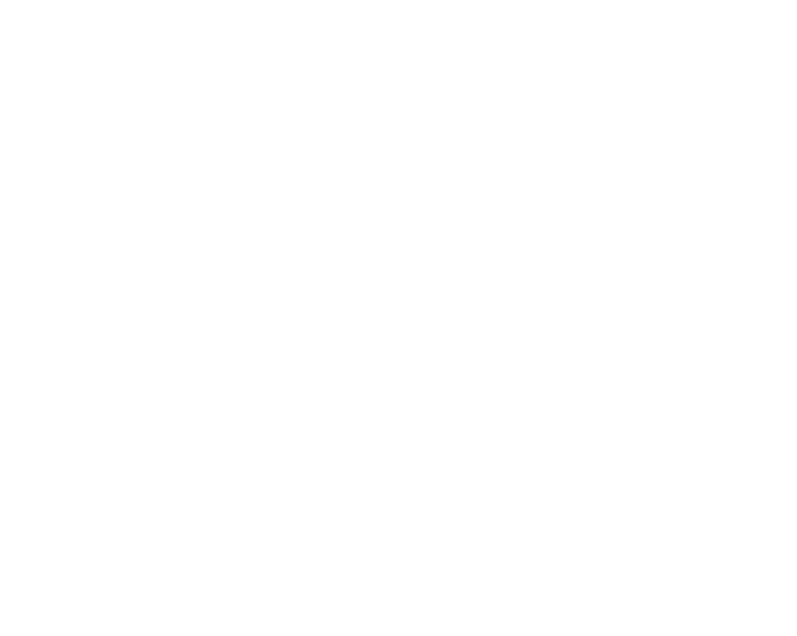

multi\_optimize
================

.. toctree::
   :glob:
   :maxdepth: 4
   :caption: Methods

   multi-optimize/gd-constant.rst
   multi-optimize/gd-fractional.rst
   multi-optimize/gd-optimal.rst
   multi-optimize/gd-nonlinear_conjugate.rst
   multi-optimize/bfgs.rst
   multi-optimize/constr-lagrangian.rst
   multi-optimize/log-barrier.rst
   multi-optimize/primal-dual.rst

You can choose the best model using our flowchart

