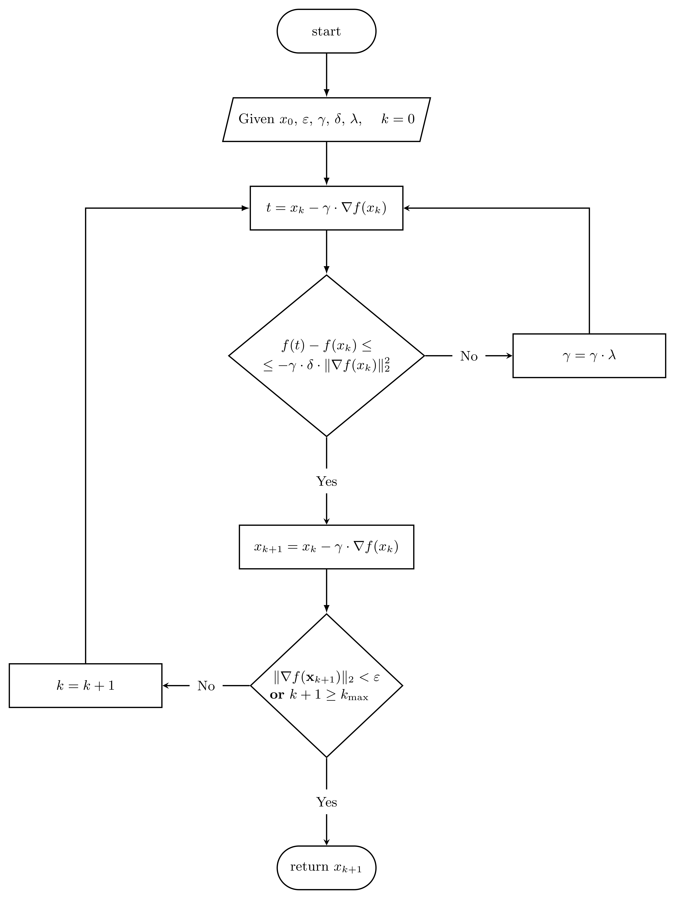

multi\_optimize
================

:math:`\rule{125mm}{0.7pt}`

.. rubric:: Gradient descent with optimal step. Algorithm Flowchart

:math:`\rule{125mm}{0.7pt}`

.. image:: ../_static/flowcharts/GRAD_OPTIMAL_STEP_FLOWCHARTS.png
    :width: 150mm
    :alt: gradient descent with optimal step algorithm
    :align: center

:math:`\rule{125mm}{0.7pt}`

.. autofunction:: nueramic_mathml.multi_optimize.gd_optimal_step

:math:`\rule{125mm}{0.7pt}`

.. rubric:: Gradient descent with fractional step. Algorithm Flowchart

:math:`\rule{125mm}{0.7pt}`

:math:`\rule{125mm}{0.7pt}`

.. autofunction:: nueramic_mathml.multi_optimize.gd_frac_step

:math:`\rule{125mm}{0.7pt}`

.. rubric:: Gradient descent with constant step. Algorithm Flowchart

:math:`\rule{125mm}{0.7pt}`

.. image:: ../_static/flowcharts/GRAD_CONST_STEP_FLOWCHARTS.png
    :width: 150mm
    :alt: gradient descent with constant step algorithm
    :align: center

:math:`\rule{125mm}{0.7pt}`

.. autofunction:: nueramic_mathml.multi_optimize.gd_constant_step

:math:`\rule{125mm}{0.7pt}`

.. rubric:: Nonlinear conjugate gradient method. Algorithm Flowchart

:math:`\rule{125mm}{0.7pt}`

.. image:: ../_static/flowcharts/FR_ALG_FLOWCHARTS.png
    :width: 150mm
    :alt: Nonlinear conjugate gradient method
    :align: center

:math:`\rule{125mm}{0.7pt}`

.. autofunction:: nueramic_mathml.multi_optimize.nonlinear_cgm

.. autofunction:: nueramic_mathml.multi_optimize.bfgs