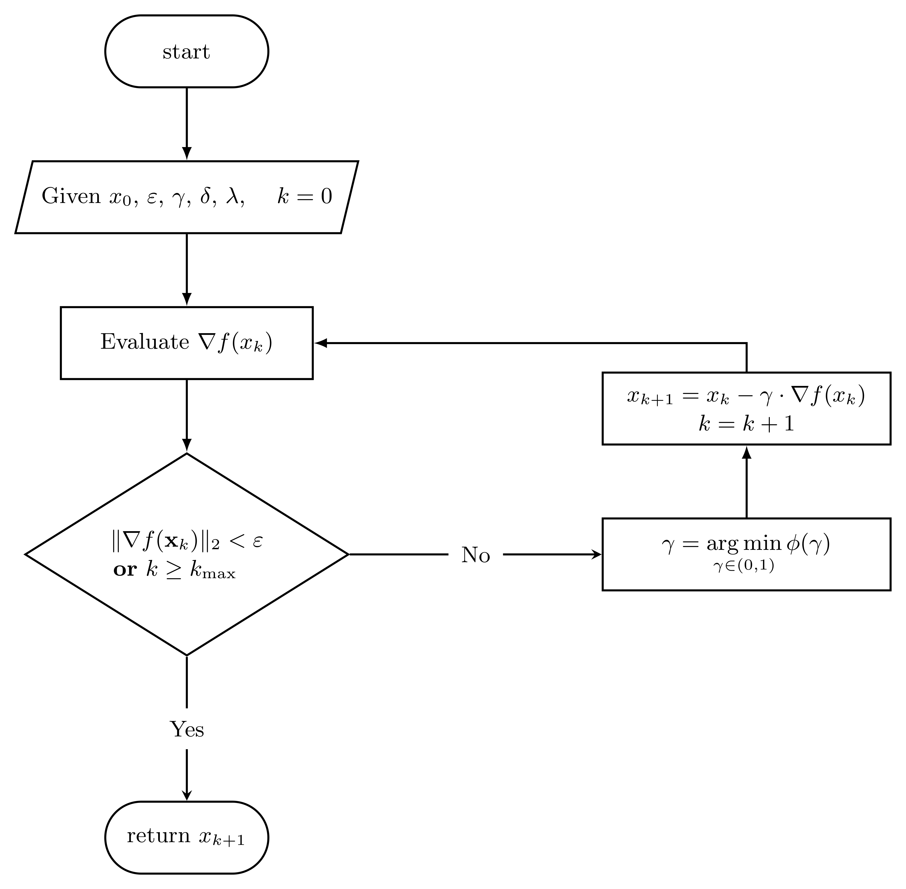

multi\_optimize
================

:math:`\rule{125mm}{0.7pt}`

.. rubric:: Gradient descent with optimal step. Algorithm Flowchart

:math:`\rule{125mm}{0.7pt}`

:math:`\rule{125mm}{0.7pt}`

.. autofunction:: nueramic_mathml.multi_optimize.gd_optimal_step

